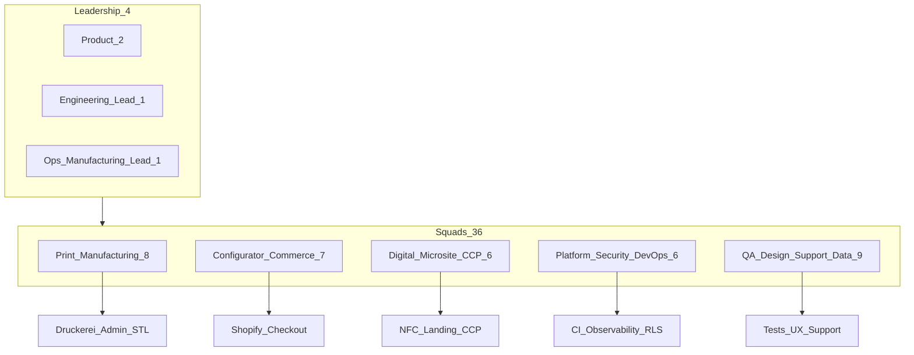
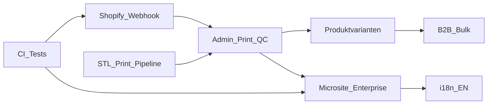

# NUDAIM Jahres-Roadmap: Hochprofessionell (40 Personen, 24/7)

Stand: 2026-07-19  
Horizont: Q3/2026 – Q2/2027 (12 Monate)  
Kapsel: kanonische Team-Quelle für Langfrist-Prioritäten. Kurzfristiges Backlog bleibt in [`VORHABEN.md`](VORHABEN.md).

---

## 1. Produktprinzip

**Kernprodukt:** physischer NFC-Schlüsselanhänger (3D/Logo-Prägung).  
**Zusatz:** Microsite / Chip-Link / CCP – markenstark, aber sekundär.

Kein Feature-Friedhof: Digitale Seite wächst kontrolliert. **Print + Shopify-Ops + CI** dominieren die ersten 6 Monate.

---

## 2. Ausgangslage (Code-Stand 2026-07)

### Stark heute

- Zwei-Phasen-Konfigurator (`pages/ConfiguratorPage.tsx`)
- Logo-Pipeline Preview vs. Print (`lib/logoFromRaster.ts`, `lib/logoProcess.ts`)
- Microsite, CCP, Admin
- Shopify-Cart-Handoff inkl. Line-Item-Properties
- Security-Fixes dokumentiert (`SECURITY_ISSUES.md`)
- **Erledigt (Dominik, 2026-07-19):** Shopify-Bestellmail/Liquid live + echte Testbestellung (Properties → Mail → CCP)

### Kritische Lücken

| Bereich | Ist |
|--------|-----|
| Fertigung | STL-Export in `KeychainPreview` stubbed (`exportSTL` → `null`); 3D in `Viewer.tsx` nicht im Hauptflow |
| Betrieb | Admin-Orders manuell; **kein** Shopify-Webhook-Sync Order → Admin |
| Engineering | Keine Tests/CI/Lint; `README.md` leer |
| Digital | Mini-Website-Ziel laut `VORHABEN.md` unvollständig |
| Querschnitt | Observability, Rate-Limits, i18n, A11y fehlen systematisch |

---

## 3. Zielbild in 12 Monaten

Kunde konfiguriert → unverbindliche, aber ehrliche Vorschau mit Legal-Hinweisen → Checkout läuft vollautomatisch (Shopify ↔ Backend) → Produktion erhält prüfbare Print-Assets + STL → Status/Tracking im CCP → Microsite ist markenstark und messbar → Team hat CI, Observability, SLOs.

---

## 4. Organisationsmodell: 40 Personen, 24/7

**Modell:** Follow-the-Sun (3 Schichten × ~8h) – nicht „jeder arbeitet 24h“. Ziel: jederzeit On-Call, Production-Support und CI-Grün.

| Squad | Kopf | Auftrag |
|-------|------|---------|
| **Print & Manufacturing** | 8 | STL/G-Code-Pipeline, Print-QC, Admin-Produktionsboard, Material/Farbkalibrierung |
| **Configurator & Commerce** | 7 | Anhänger-UX, Variantenkatalog, Shopify Sync, Pricing, Bulk/B2B |
| **Digital (Microsite + CCP)** | 6 | Mini-Website, Analytics, Brand-Chat, Edit-after-order |
| **Platform, Security, DevOps** | 6 | CI/CD, Monitoring, Rate-Limits, Threat Model, Multi-Env |
| **QA, Design, Support, Data** | 9 | E2E, Design System, CS-Tools, Dashboards, Legal/Copy |
| **Leadership** | 4 | Roadmap, Priorisierung, Vendor (Shopify/Supabase/Druckerei) |

**Kapazität (grob):** ~40 FTE × ~1.600 produktive Stunden/Jahr ≈ **64.000 Personenstunden**.

**Arbeitsrhythmus:** 2-Wochen-Sprints, Release-Train freitags, Hotfix-Lane 24/7, Security-Review nach jedem großen Diff.

### Schichtmodell (24/7)

| Schicht | Fokus |
|---------|--------|
| EU-Tag | Feature-Entwicklung, Produkt, Design-Reviews |
| Überlapp US/APAC | CI-Grün halten, Deploy-Fenster, Pairing |
| Nacht / On-Call | Incidents, Webhook-Fails, Production-Blocker |

---

## 5. KPIs (ganzes Jahr)

| KPI | Zielrichtung |
|-----|----------------|
| Conversion Konfigurator → Checkout | steigern, monatlich tracken |
| Reprint-Rate (Fertigung) | senken (Print-QC + klare Legal-Copy) |
| Support-Tickets / Order | senken |
| p95 Save-Latency (Config speichern) | Budget festlegen & halten |
| Failed Shopify-Webhooks | &lt; 0,5 % / Monat nach Sync-Go-Live |
| Microsite-Uptime | ≥ 99,5 % (ab Q4) |
| Fertigungs-SLA | z. B. Produktionsstart ≤ 48h nach `paid` |
| CI: Main grün | ≥ 99 % der Werktage |

---

## 6. Querschnittsthemen (ganzes Jahr)

- **Legal/UX-Texte:** immer prüfen – nötig? redundant? zu technisch?
- **3D-Druck-Disclaimer:** Vorschau unverbindlich; max. 3 Farben; Farbtöne können abweichen
- **Security:** Threat-Model-Reviews; keine offenen Writes; Token-Rotation
- **Manufacturing SLA:** dokumentiert und im Admin sichtbar
- **Kein Webflow-Klon** im Jahr-1-Kern

---

## 7. Quartalsplan

### Q1 (Monate 1–3) – Fundament & Fertigung (Must)

Fokus: Produktionsfähigkeit und Engineering-Hygiene.

| # | Thema | Status / Hinweis |
|---|--------|------------------|
| 1 | **STL/Print-Pipeline wieder live** – Viewer-STL oder neue Engine; `svgForProduction` → Fertigungsjob; Admin zeigt druckfertige Assets | offen |
| 2 | **CI/CD** – GitHub Actions: `tsc`, Lint, Build, Preview-Deploys; Branch-Schutz | offen |
| 3 | **Test-Grundlage** – Unit Logo/Validation; Playwright Smoke (Upload → Save → Cart-URL) | offen |
| 4 | **Security-Deploy abschließen** – Rest aus `SECURITY_ISSUES.md`; Cloudflare Rate-Limit; Scan-Flooding | offen |
| 5a | **Shopify Live-Delivery** – Liquid + Smoke Order | **erledigt 2026-07-19** |
| 5b | **Shopify Order-Sync** – Webhook Order → Status `paid` in Admin (`lib/ordersApi.ts`) | offen |
| 6 | **Observability** – Sentry + Basis-Analytics; Error-Budgets | offen |

**Exit-Kriterien Q1:** Admin sieht bezahlte Orders automatisch + Print-Assets; Main immer grün. (Mail/CCP-Smoke bereits grün.)

---

### Q2 (Monate 4–6) – Commerce-Profi & Varianten

1. **Produktkatalog** – echte Variant-IDs (Badge, Größen, Materialien); Preisregeln
2. **B2B/Bulk** – Mengenrabatt, Firmenrechnung, Sammelbestellung
3. **Print-QC UI** – 3-Farben-Preview für Produktion (getrennt von Kunden-Live-Vorschau); Freigabe-Workflow
4. **Farbmanagement** – Material-/Filament-Profile; dokumentierte Toleranzen (Legal-Copy bleibt führend)
5. **Admin 2.0** – Queue, Filter, Batch-Export für Druckerei, Shopify-Deep-Links
6. **Design System** – Tokens, Komponentenbibliothek, A11y-Pass WCAG 2.2 AA Kernflows

**Exit-Kriterien Q2:** ≥2 physische Produktvarianten live; Produktionsqueue ohne manuelles CSV-Chaos.

---

### Q3 (Monate 7–9) – Digitale Seite Enterprise

Anschluss an `VORHABEN.md`, ohne Anhänger zu verwässern:

1. Reichere Blöcke (Galerie, FAQ, Preise, Öffnungszeiten)
2. Section-Builder (Abstände, Ausrichtung, Duplizieren)
3. Multi-Page/Anker-Nav + SEO/Share-Preview
4. Brand-Chat 2.0 (URL/PDF scrape, bessere Validierung)
5. CCP: Versionierung, Rollback, Scan-Insights (ohne Spam)
6. Stempelkarte serverseitig (Anti-Cheat) – wenn B2B-Nachfrage da

**Exit-Kriterien Q3:** Microsite wirkt wie „kleine Markenwebsite“; CCP für Nicht-Techniker bedienbar.

---

### Q4 (Monate 10–12) – Skala, International, Moat

1. **i18n** (DE/EN zuerst), Multi-Currency Shopify
2. **Partner-API** – Agenturen konfigurieren programmatisch
3. **NFC-Ops** – Chip-Programmierung/Batch-Encoding-Doku + Tooling (auch wenn Hardware extern)
4. **Performance** – Edge-Caching Microsite, Image-CDN, Lighthouse-Budgets
5. **Compliance** – DSGVO-Paket, AVV, Auftragsdaten, Impressum-Flows; Print-Disclaimer zentral
6. **Moat-Features** – Nachbestellung gleiches Logo, A/B Landing, White-Label

**Exit-Kriterien Q4:** EN-Markt pilotierbar; ≥99,5 % Microsite-Uptime; dokumentierte Fertigungs-SLA.

---

## 8. Squad-Backlogs (Jahr-1, priorisiert)

### 8.1 Print & Manufacturing (8)

**Q1**
- STL-Pipeline an Save-/Admin-Flow anbinden (statt Stub in `KeychainPreview`)
- Produktions-PNG aus `svgForProduction` / Print-Raster exportieren & speichern
- Admin: Druck-Assets + Status sichtbar
- Materialliste + Farbtoleranz-Doku (intern)

**Q2**
- Print-QC-Freigabe (Mensch-in-the-Loop optional)
- Batch-Export für Druckerei
- Filament-/Platten-Profile

**Q3–Q4**
- SLA-Tracking; Nachdruck-Workflow; Qualitätsmetriken (Reprint-Rate)

### 8.2 Configurator & Commerce (7)

**Q1**
- Shopify Webhook → Order/`paid` in Backend
- Cart-Properties stabil halten; Variant-Mapping vorbereiten

**Q2**
- Mehrere physische Varianten (Badge etc.) mit echten Shopify Variant-IDs
- Pricing / Mengenstaffeln; B2B-Checkout-Pfad

**Q3–Q4**
- Nachbestellung; Partner-Handoff; Multi-Currency

### 8.3 Digital Microsite + CCP (6)

**Q1**
- Stabilität & Security bei bestehenden Layouts; keine Scope-Explosion

**Q2**
- A11y + Design-Tokens mit Squad QA/Design

**Q3**
- Blöcke, Section-Builder, Nav, Brand-Chat 2.0 (siehe Quartalsplan)
- CCP Versionierung / Insights

**Q4**
- i18n der Microsite; Share-Preview; Performance

### 8.4 Platform, Security, DevOps (6)

**Q1**
- GitHub Actions CI; Preview-Deploys; Branch-Schutz
- Sentry; Rate-Limits (Cloudflare/Supabase)
- Rest-Checkliste `SECURITY_ISSUES.md`

**Q2**
- Staging/Prod-Trennung; Secrets-Rotation; Backup-Drills

**Q3–Q4**
- SLO-Dashboards; Partner-API Auth; Compliance-Logging

### 8.5 QA, Design, Support, Data (9)

**Q1**
- Unit + Playwright Smoke
- Legal-Copy zentral pflegen (Vorschau vs. Druck)
- Support-Playbooks (Mail/CCP/Order)

**Q2**
- Design System; WCAG AA Kernflows; Admin-UX für Ops

**Q3–Q4**
- Analytics-Dashboards (Conversion, Scans, Tickets); EN-Copy; CS-Tools

### 8.6 Leadership (4)

- Quartals-OKRs; Vendor-Verträge (Shopify, Supabase, Druckerei)
- Kapazitätssteuerung gegen Feature-Creep
- Go/No-Go an Quartals-Exit-Kriterien

---

## 9. Abhängigkeiten (kritischer Pfad)

Ohne **STL + Webhook + CI** keine seriöse Skalierung von Varianten oder Digital-Enterprise.

---

## 10. Bewusst nicht im Jahr-1-Kern

- Vollständiger Website-Builder à la Webflow
- Beliebige Custom-CSS / freies HTML in der Microsite
- Eigenes ERP ersetzen (Shopify bleibt Source of Truth für Zahlung)
- Hardware-NFC-Writer als Consumer-Produkt (nur Ops-Tooling)

---

## 11. Bezug zu bestehenden Docs

| Doc | Rolle |
|-----|--------|
| [`VORHABEN.md`](VORHABEN.md) | Kurzfristiges Slice-Backlog |
| [`SECURITY_ISSUES.md`](SECURITY_ISSUES.md) | Security-Schuld & Deploy-Checkliste |
| [`SHOPIFY_EMAIL_TESTEN.md`](SHOPIFY_EMAIL_TESTEN.md) | Mail-Smoke (Live-Test erledigt) |
| Diese Datei | Jahres-Org, Quarters, Squads, KPIs |

---

## 12. Nächster konkreter Schritt (nach Roadmap-Commit)

1. Q1 starten mit **STL-Pipeline** + **CI** parallel zu **Shopify-Webhook**
2. `VORHABEN.md`-Slices nur so weit, dass sie Print/Commerce nicht blockieren
3. Quartals-Review an Exit-Kriterien – Scope streichen statt strecken
